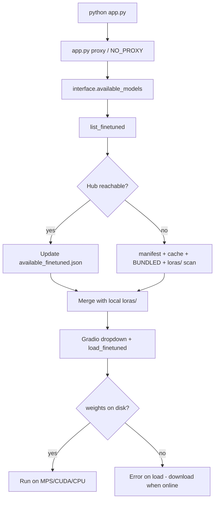

# VampNet: Local / Offline Setup (VPN & Hugging Face)

This guide documents the custom changes in `vampnet-main` so the Gradio app can run **using models already on disk**, even when Hugging Face Hub is slow, blocked, or unreachable (VPN, firewall, Cursor proxy issues).

A backup of the original `app.py` (before these edits) is kept as [`app_backup.py`](../app_backup.py). Upstream VampNet is at [hugofloresgarcia/vampnet](https://github.com/hugofloresgarcia/vampnet).

---

## Table of contents

1. [What problem this solves](#what-problem-this-solves)
2. [Why you may see this and others do not](#why-you-may-see-this-and-others-do-not)
3. [Files changed (summary)](#files-changed-summary)
4. [Step-by-step: apply or verify the changes](#step-by-step-apply-or-verify-the-changes)
5. [How to run locally](#how-to-run-locally)
6. [Optional: when you want Hugging Face again](#optional-when-you-want-hugging-face-again)
7. [Troubleshooting](#troubleshooting)

---

## What problem this solves

| Symptom | Cause | What the changes do |
|--------|--------|------------------------|
| `Couldn't access the Hub … timed out` | VPN/proxy/DNS; Hub unreachable from Python | Use **cached** weights; skip live Hub listing when offline |
| `Could not reach Hugging Face Hub` in dropdown | `list_finetuned()` used to **require** Hub | Fall back to **manifest + cache + local folders** |
| Gradio fails to start / self-check errors | `localhost` sent through HTTP proxy | Set `NO_PROXY` for `127.0.0.1` |
| Hub works in browser but not in `python app.py` | Cursor injects `HTTP_PROXY=127.0.0.1:56883` | Strip that port only; optional `VAMPNET_PROXY` for Clash/V2Ray |
| Wrong working directory | `app.py` lives in `vampnet-main/` | Run from `vampnet-main` (see [How to run](#how-to-run-locally)) |

**Important:** You still need the weight files under `models/vampnet/` (and `models/vampnet/loras/<name>/` for finetunes). These changes do not download models for you when offline—they let the app **use what you already have**.

---

## Why you may see this and others do not

This is usually **environment-specific**, not a bug in your skills or hardware.

1. **Upstream assumes live Hub access**  
   Stock [`vampnet/__init__.py`](https://github.com/hugofloresgarcia/vampnet/blob/main/vampnet/__init__.py) calls `HfFileSystem().listdir(...)` on every `list_finetuned()`. That works on Hugging Face Spaces, university networks, or regions with reliable access to `huggingface.co`. On a home Mac behind VPN, listing can **time out** even when cached files exist.

2. **Official demos run in the cloud**  
   Many users try VampNet on [Hugging Face Spaces](https://huggingface.co/hugggof) where outbound Hub traffic is fast and proxies are configured for them. You are running **locally on macOS (MPS)**—a different network path.

3. **Cursor + VPN stack**  
   Cursor can set `HTTP_PROXY` / `HTTPS_PROXY` to a local port (e.g. `56883`) that is not your VPN client. Python’s `huggingface_hub` honors those variables; the browser may use the VPN tunnel directly. Result: **browser OK, Python times out**.

4. **`models/` is gitignored**  
   Others who followed the README with good connectivity downloaded weights once; their Hub calls succeeded. You may have partial caches plus timeouts on **metadata** checks (`etag`), which still log warnings but can fall back to local files for `coarse.pth` / `c2f.pth` if present.

5. **VPN is not one thing**  
   System VPN (TUN), browser extension, and HTTP proxy (Clash `7897`) behave differently. Without `VAMPNET_PROXY`, Python might not use the same route as your browser.

So: **others are not “immune”—they often never hit the same Hub + proxy + local IDE combination you have.**

---

## Files changed (summary)

| File | Role |
|------|------|
| [`app.py`](../app.py) | Proxy/timeout env, startup model list, Gradio bind to `127.0.0.1:7860` |
| [`vampnet/__init__.py`](../vampnet/__init__.py) | Offline-friendly `list_finetuned()` with cache, manifest, bundled names |
| [`conf/available_finetuned.json`](../conf/available_finetuned.json) | Shipped list of finetune names (in git) |
| [`models/vampnet/available_finetuned.json`](../models/vampnet/available_finetuned.json) | Auto-updated when Hub works (often gitignored with `models/`) |
| [`app_backup.py`](../app_backup.py) | Pre-change copy of `app.py` for reference |

`download_default()` / `download_finetuned()` were already **skip-if-exists** in upstream; we did not change that logic.

---

## Step-by-step: apply or verify the changes

### Step 1 — `vampnet/__init__.py`: offline model list

**Goal:** Populate the model dropdown without calling Hub when offline.

Add at the top (after `MODELS_DIR`):

- `FINETUNED_CACHE_FILE` → `models/vampnet/available_finetuned.json`
- `FINETUNED_MANIFEST` → `conf/available_finetuned.json`
- `BUNDLED_FINETUNED` → hardcoded list of known public finetune names (fallback of last resort)

Add helpers:

- `_list_local_finetuned()` — scan `models/vampnet/loras/*/` for `coarse.pth` + `c2f.pth`
- `_load_finetuned_cache()` — read manifest, then cache file, then `BUNDLED_FINETUNED`
- `_save_finetuned_cache(names)` — write Hub result when online
- `_merge_finetuned_names(...)` — union of several lists

Replace stock `list_finetuned()` (Hub-only) with:

```python
def list_finetuned(repo_id=DEFAULT_HF_MODEL_REPO):
    cached = _load_finetuned_cache()
    local = _list_local_finetuned()
    try:
        names = _list_finetuned_from_hub(repo_id)
        _save_finetuned_cache(names)
        return _merge_finetuned_names(names, local)
    except Exception as e:
        warnings.warn(
            f"Could not reach Hugging Face Hub ({e}). "
            "Using cached / downloaded finetuned model names for the dropdown."
        )
        return _merge_finetuned_names(cached, local, BUNDLED_FINETUNED)
```

**Priority when offline:** names on disk (`loras/`) + `conf/available_finetuned.json` + bundled list + `"default"`.

---

### Step 2 — `conf/available_finetuned.json`

**Goal:** Ship a model name list in the repo (since `models/` is often not committed).

Create [`conf/available_finetuned.json`](../conf/available_finetuned.json) as a JSON array of finetune folder names, e.g.:

```json
[
  "cat10",
  "choir",
  "..."
]
```

Match names under `models/vampnet/loras/<name>/` that you actually downloaded.

---

### Step 3 — `app.py`: network / proxy block (top of file)

**Goal:** Gradio works on localhost; Hub gets sane timeouts; Cursor proxy does not break Python.

Insert **before** `import spaces` (and before any Hub-using imports):

```python
import os
import re

# Localhost must bypass proxy (Gradio startup-events self-check).
os.environ["NO_PROXY"] = "localhost,127.0.0.1,::1," + os.environ.get("NO_PROXY", "")
os.environ["no_proxy"] = os.environ["NO_PROXY"]

# Longer Hub timeouts (listing loras can take many API round-trips).
os.environ.setdefault("HF_HUB_ETAG_TIMEOUT", "60")
os.environ.setdefault("HF_HUB_DOWNLOAD_TIMEOUT", "300")

# Cursor injects a broken local proxy (e.g. :56883). Strip only that — keep Clash (:7897).
_IDE_PROXY_PORTS = {56883}

def _local_proxy_port(url: str) -> int | None:
    match = re.match(r"https?://127\.0\.0\.1:(\d+)", url or "")
    return int(match.group(1)) if match else None

for _proxy_var in (
    "HTTP_PROXY", "HTTPS_PROXY", "ALL_PROXY",
    "http_proxy", "https_proxy", "all_proxy",
):
    _proxy_url = os.environ.get(_proxy_var, "")
    _port = _local_proxy_port(_proxy_url)
    if _port is not None and _port in _IDE_PROXY_PORTS:
        os.environ.pop(_proxy_var, None)

# Optional: force Clash/V2Ray, e.g. export VAMPNET_PROXY=http://127.0.0.1:7897
_vampnet_proxy = os.environ.get("VAMPNET_PROXY", "").strip()
if _vampnet_proxy:
    os.environ["HTTP_PROXY"] = _vampnet_proxy
    os.environ["HTTPS_PROXY"] = _vampnet_proxy
```

| Setting | Why |
|---------|-----|
| `NO_PROXY` for `127.0.0.1` | Gradio must talk to itself without going through VPN/proxy |
| `HF_HUB_*_TIMEOUT` | Slow VPN links need more than default seconds |
| Strip port `56883` | Cursor’s proxy often breaks `huggingface_hub` |
| `VAMPNET_PROXY` | Optional: route **only** Python through your VPN client’s HTTP port |

---

### Step 4 — `app.py`: startup model list (once)

**Goal:** Resolve dropdown choices once at startup; avoid invalid `DEFAULT_MODEL`.

Replace immediate load with:

```python
_AVAILABLE_MODELS = interface.available_models()
if init_model_choice not in _AVAILABLE_MODELS:
    init_model_choice = "default"
print(f"models in dropdown ({len(_AVAILABLE_MODELS)}): {_AVAILABLE_MODELS}\n")
interface.load_finetuned(init_model_choice)
```

In the Gradio UI, set the model dropdown to:

```python
model_choice = gr.Dropdown(
    label="model choice",
    choices=_AVAILABLE_MODELS,
    value=init_model_choice,
    interactive=True,
    filterable=True,
    visible=True,
)
```

Optional `@demo.load` handler to refresh choices from `_AVAILABLE_MODELS` when the page loads.

---

### Step 5 — `app.py`: local Gradio URL

**Goal:** Open the UI on your machine without `share=True` (public Gradio link).

Change launch from upstream’s:

```python
demo.launch(share=True)
```

to:

```python
demo.launch(server_name="127.0.0.1", server_port=7860)
```

Then open: **http://127.0.0.1:7860**

---

### Step 6 — Ensure weights exist on disk

**Goal:** Offline inference needs local checkpoints.

Minimum for **default** model:

- `models/vampnet/coarse.pth`
- `models/vampnet/c2f.pth`
- `models/vampnet/wavebeat.pth`
- `models/vampnet/codec.pth` (via `hf_hub_download` cache or `local_dir`)

Per finetune:

- `models/vampnet/loras/<name>/coarse.pth`
- `models/vampnet/loras/<name>/c2f.pth`

If these are missing, the app may still **list** `<name>` from the manifest but **fail when loading** that model until you download once while online.

---

## How to run locally

```bash
conda activate vampnet_env   # or your env name
cd /path/to/VampNet/vampnet-main
python app.py
```

- **Do not** run `python app.py` from the parent `VampNet/` folder (`app.py` is only inside `vampnet-main/`).
- Expect Hub **warnings** when offline; look for:  
  `models in dropdown (N): [...]`  
  If `N > 0` and your weights exist, you can use the UI.

Success indicators:

- `using device mps` (or `cuda` / `cpu`)
- `loading default vampnet`
- `models in dropdown (18): [...]` (count may vary)
- Browser loads http://127.0.0.1:7860

---

## Optional: when you want Hugging Face again

1. Connect VPN or set your client’s HTTP proxy, then:

   ```bash
   export VAMPNET_PROXY=http://127.0.0.1:7897   # use your app’s port
   python app.py
   ```

2. Test connectivity:

   ```bash
   curl -I --max-time 15 https://huggingface.co
   ```

3. When Hub works, `list_finetuned()` will refresh `models/vampnet/available_finetuned.json` automatically.

4. To download a new finetune while online, pick it in the UI or use the library; `download_finetuned()` fetches only missing files.

---

## Troubleshooting

| Issue | What to check |
|-------|----------------|
| `No such file or directory: app.py` | `cd vampnet-main` |
| Dropdown empty or tiny | Add [`conf/available_finetuned.json`](../conf/available_finetuned.json); ensure `loras/<name>/` has both `.pth` files |
| Model in dropdown but load fails | Weights missing for that name; download once online or copy from another machine |
| Hub warnings only | Normal offline; app can still run if caches exist |
| Gradio won’t open | Firewall; confirm `127.0.0.1:7860` and `NO_PROXY` block in `app.py` |
| Hub works in browser, not Python | `echo $HTTP_PROXY`; try `VAMPNET_PROXY` or unset Cursor proxy |

---

## Reverting to upstream behavior

1. Restore `app.py` from [`app_backup.py`](../app_backup.py) or upstream GitHub `app.py`.
2. Restore `vampnet/__init__.py` from [upstream `vampnet/__init__.py`](https://github.com/hugofloresgarcia/vampnet/blob/main/vampnet/__init__.py) (Hub-only `list_finetuned`).
3. Remove optional `conf/available_finetuned.json` if you do not need it.

You will need reliable Hugging Face access for the model dropdown and first-time downloads.

---

## Quick reference: data flow when offline



---

*Last updated for the customized tree under `vampnet-main` (local Mac + MPS + VPN/HF timeout scenario).*
